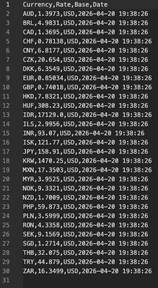

# Currency Data Pipeline

Простой практический опыт в написании ETL пайплайна (хоть пока что и без записи в БД)

## Стек:
- **Python 3.13.2**
- ***Requests*
- **Pandas**
- **Loguru**

## Структура:
'''text

.
├── data/               # Папка с результатами (создается автоматически)
├── utils/
│   └── decorators.py   # Декораторы для логгирования
├── pipeline.py         # Основные функции (Extract, Transform, Load)
├── main.py             # Точка входа в программу
├── requirements.txt    # Список зависимостей
└── .gitignore          # Исключение системных файлов и .venv

## Результаты:
